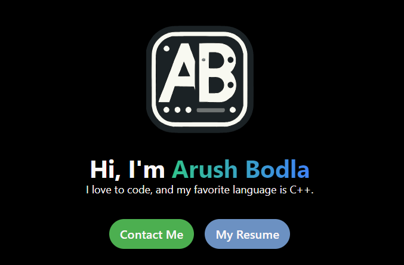

# Arush Bodla — Portfolio Website

A personal portfolio website for Arush Bodla — software developer, competitive programmer, and game developer. Built with Next.js 15 App Router and Tailwind CSS. Showcases projects, skills, and a working contact form backed by Nodemailer + Gmail SMTP.

**Live Demo:** [arushbodla.vercel.app](https://arushbodla.vercel.app)

---

## Tech Stack

| Layer | Technology |
|---|---|
| Framework | Next.js 15 (App Router) |
| Language | TypeScript |
| Styling | Tailwind CSS 3 |
| Icons | react-icons |
| Email | Nodemailer (Gmail SMTP) |
| Icons | react-icons v5 |
| Fonts | Geist Sans + Geist Mono (next/font/google) |
| Deployment | Vercel |

---

## Features

- **Hero section** — profile image, gradient headline, Contact Me + Resume CTA buttons
- **About section** — bio paragraphs, suit photo, and stats row (4+ yrs / 15+ projects / 25+ competitions)
- **Skills section** — 14 skill cards across three horizontally-scrollable rows (Development, Problem Solving, Soft Skills)
- **Projects page** — responsive 3-column card grid with screenshots, tech tags, GitHub buttons, and click-to-visit
- **Contact page** — validated form (name/email/message) with server-side email delivery via `/api/send-email`
- **Sticky navbar** — links to all sections and a Contact CTA; hides logo on mobile
- **Footer** — LinkedIn, GitHub, and Codeforces social links with dynamic copyright year
- **SEO** — OpenGraph metadata, Google site verification meta tag, manually maintained `sitemap.xml`
- **Custom Tailwind palette** — neon-green, neon-blue, gamboge, pigment-green, lake-blue, snow

---

## Project Structure

```
src/
├── app/
│   ├── layout.tsx          # Root layout: Geist fonts, metadata, global CSS
│   ├── page.tsx            # Home — composes Navbar + Homepage + About + Skills + Footer
│   ├── globals.css         # @tailwind directives only
│   ├── projects/
│   │   └── page.tsx        # Projects grid (data array + rendering, client component)
│   ├── contact/
│   │   └── page.tsx        # Contact page shell
│   └── api/
│       └── send-email/
│           └── route.ts    # POST handler — Nodemailer Gmail SMTP
├── components/
│   ├── Navbar.tsx          # Sticky nav
│   ├── Homepage.tsx        # Hero section
│   ├── About.tsx           # Bio + photo + stats
│   ├── Skills.tsx          # 3 scrollable skill rows (client component)
│   ├── Contact.tsx         # Contact form with validation (client component)
│   ├── Footer.tsx          # Social links
│   ├── CFIcon.tsx          # Custom inline Codeforces SVG icon
│   └── Progressbar.tsx     # Reusable gradient progress bar (built, not yet used)
└── assets/
    └── react.svg           # Unused CNA artifact
public/                     # Project screenshots, logo SVGs, Resume.pdf, sitemap.xml
tailwind.config.ts          # Custom color tokens + scrollbar-hide plugin
next.config.ts              # Empty (no custom config needed)
```

---

## Getting Started

### Prerequisites

- Node.js 18+
- npm or yarn

### Installation

```bash
git clone https://github.com/ArushNo1/NextJSPortfolio.git
cd NextJSPortfolio
npm install
```

### Environment Variables

Create a `.env.local` file in the project root:

```env
EMAIL_USER=your-gmail@gmail.com
EMAIL_PASSWORD=your-gmail-app-password
RECIPIENT_EMAIL=your-inbox@gmail.com
```

> Use a [Gmail App Password](https://support.google.com/accounts/answer/185833) — not your main account password.

### Development

```bash
npm run dev
```

Open [http://localhost:3000](http://localhost:3000).

### Build & Start

```bash
npm run build
npm run start
```

---

## Deployment

This project is deployed on **Vercel**. To deploy your own instance:

1. Push the repository to GitHub.
2. Import the repo at [vercel.com](https://vercel.com).
3. Add the three environment variables (`EMAIL_USER`, `EMAIL_PASSWORD`, `RECIPIENT_EMAIL`) in the Vercel project settings.
4. Deploy.

---

## Screenshots

| Home |
|---|
|  |

---

## License

This project is for personal/portfolio use. No license is currently specified.
